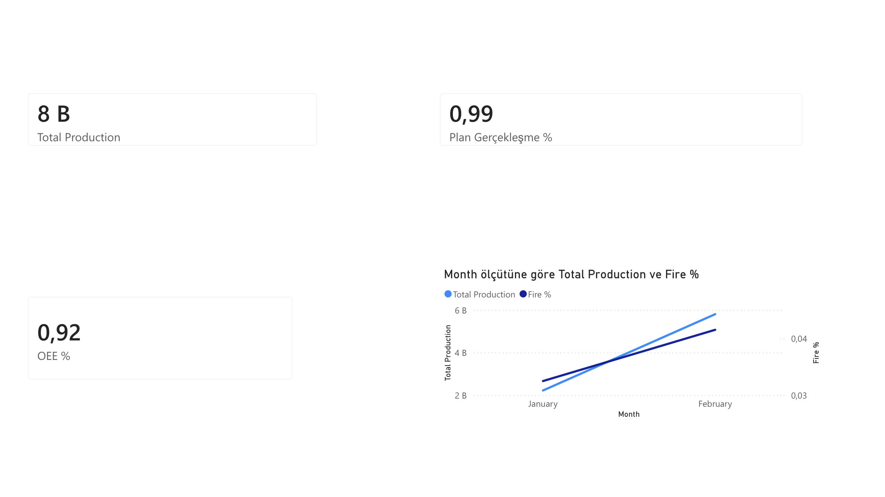
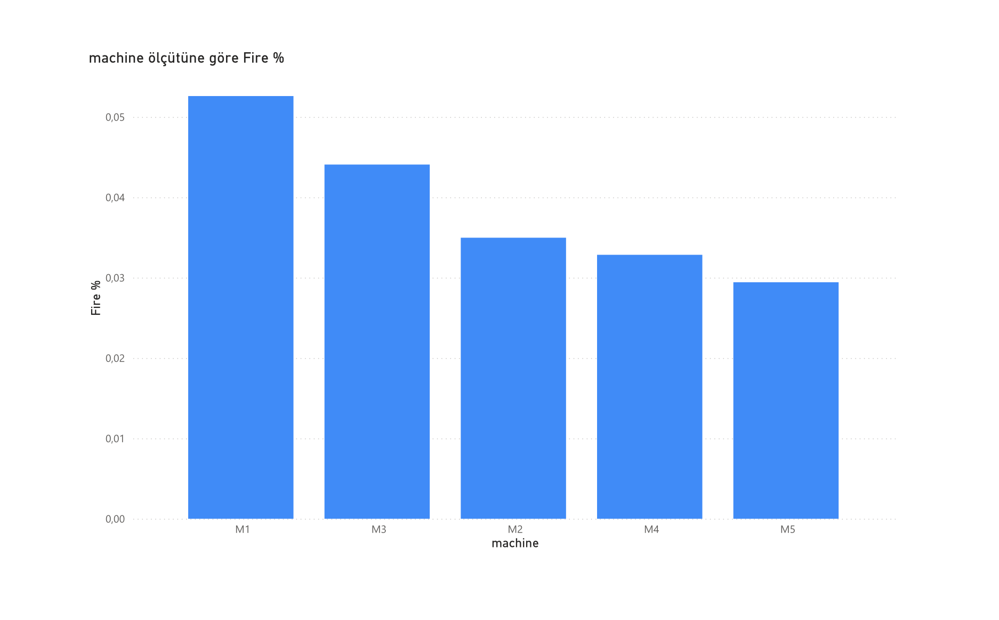
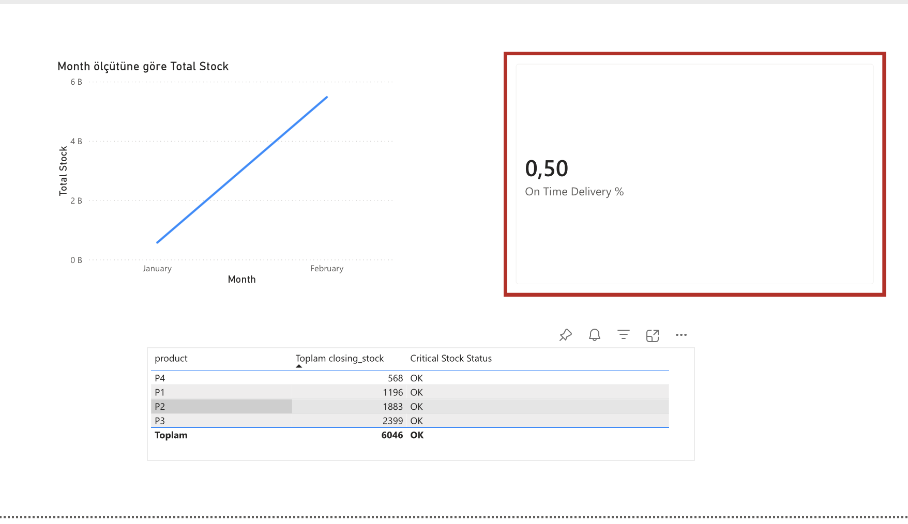
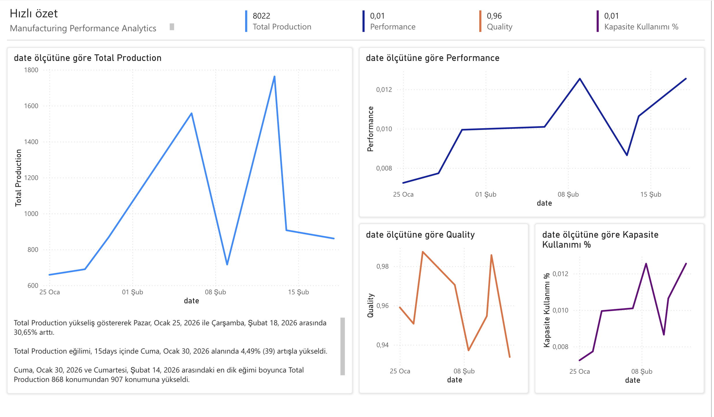

# manufacturing-kpi-dashboard
### 🚀 Manufacturing KPI & OEE Dashboard
### 📌 Project Overview
This project is an end-to-end Manufacturing Analytics solution built using Power BI and a structured relational dataset. It analyzes production performance, machine efficiency, inventory levels, and delivery performance through interactive KPI dashboards.
The goal of this project is to transform raw operational data into actionable insights for executive decision-making.
### 🏭 Executive KPIs Implemented
🔹 Total Production
🔹 Fire Rate (%)
🔹 Plan vs Actual Achievement
🔹 Capacity Utilization
🔹 On-Time Delivery (%)
🔹 Simplified OEE Score
### 📊 Dashboard Structure
##### Page 1 – Executive Overview
High-level KPIs
Monthly production trend
OEE performance indicator

##### Page 2 – Machine Analysis
Machine-based production performance
Capacity utilization comparison
Fire rate comparison by machine

##### Page 3 – Inventory & Delivery
Inventory trend over time
Critical stock monitoring
On-time delivery performance

##### 🛠️ Technologies Used
Power BI
DAX
Relational Data Modeling (Star Schema)
KPI Design & Performance Analytics

##### 📈 Key Concepts Applied
Fact & Dimension Modeling
One-to-Many Relationships
KPI Conditional Formatting
OEE Calculation Logic
Executive Dashboard Design Principles
